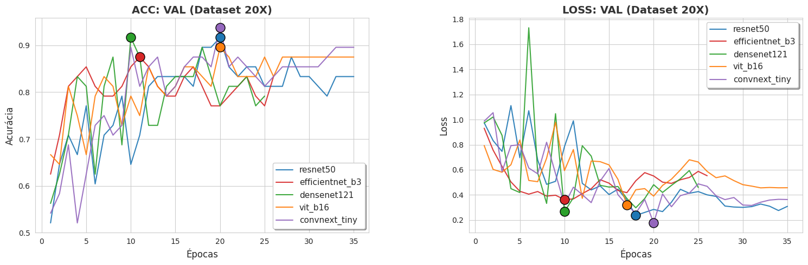
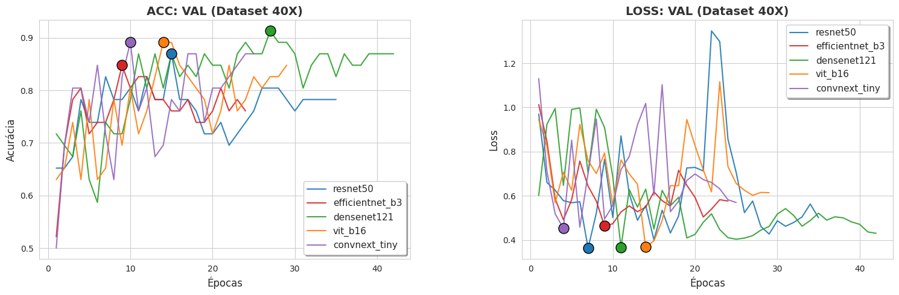
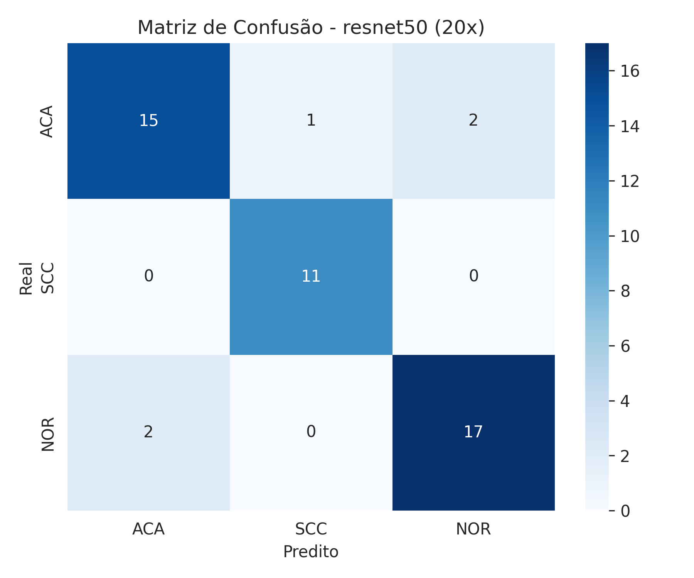
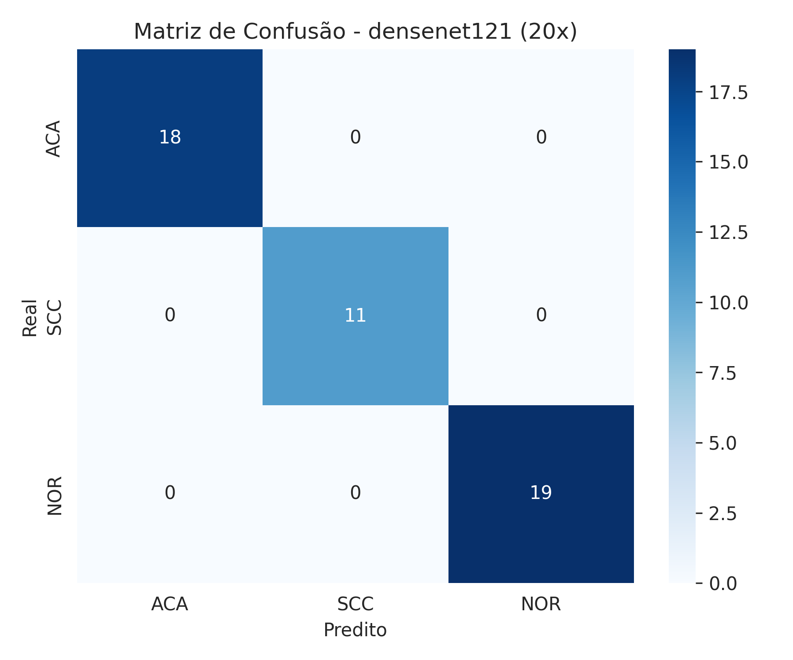
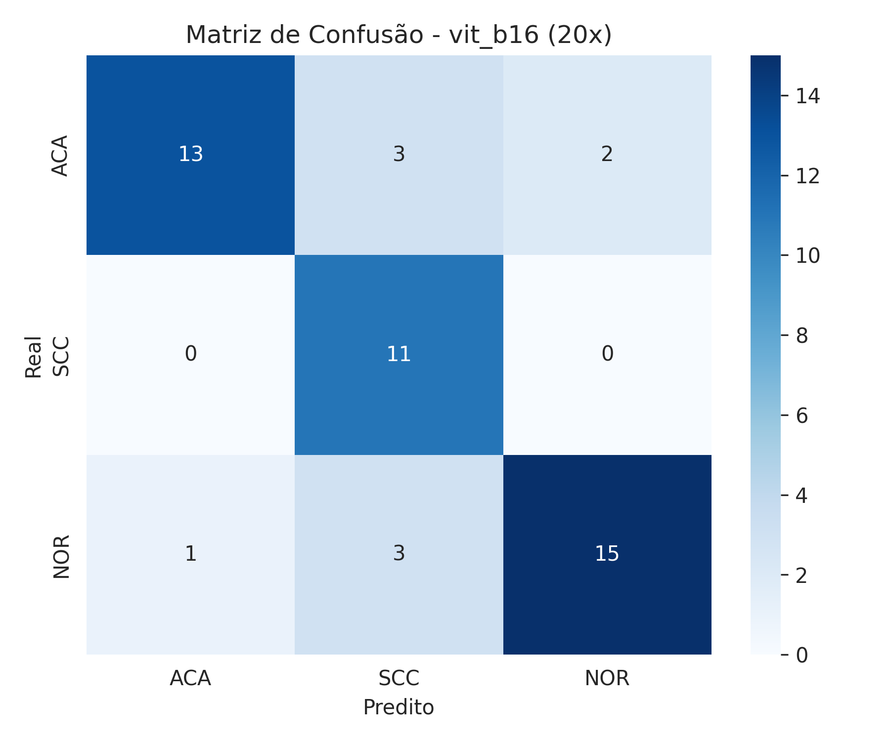
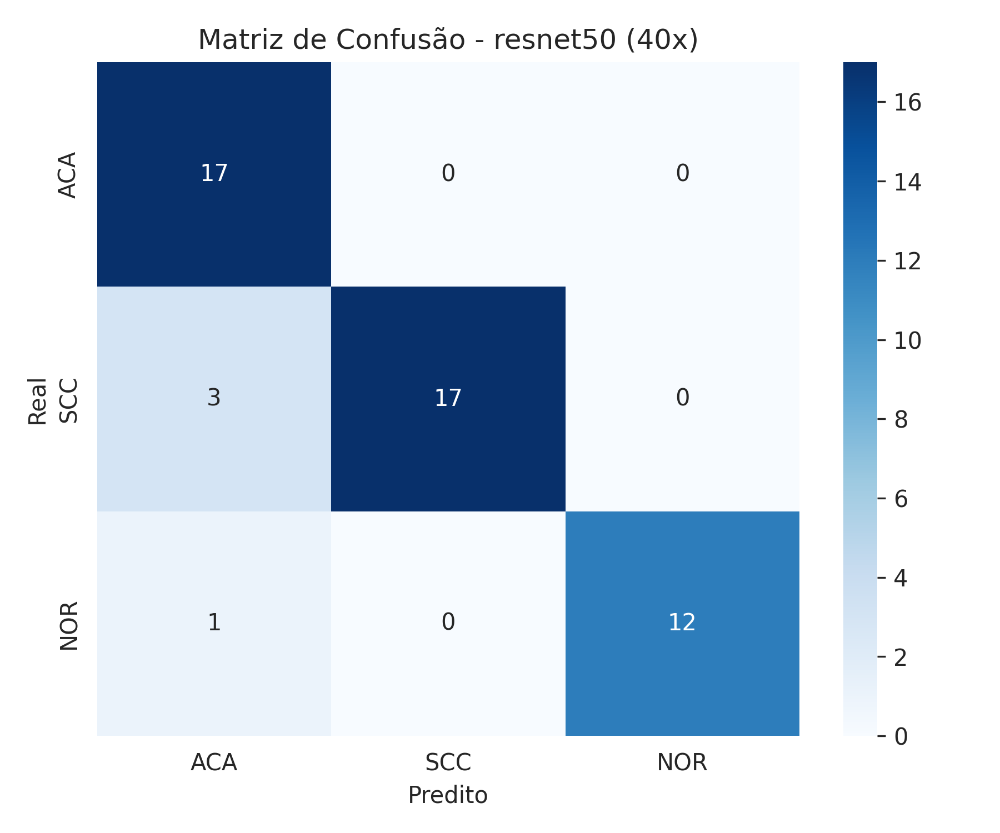
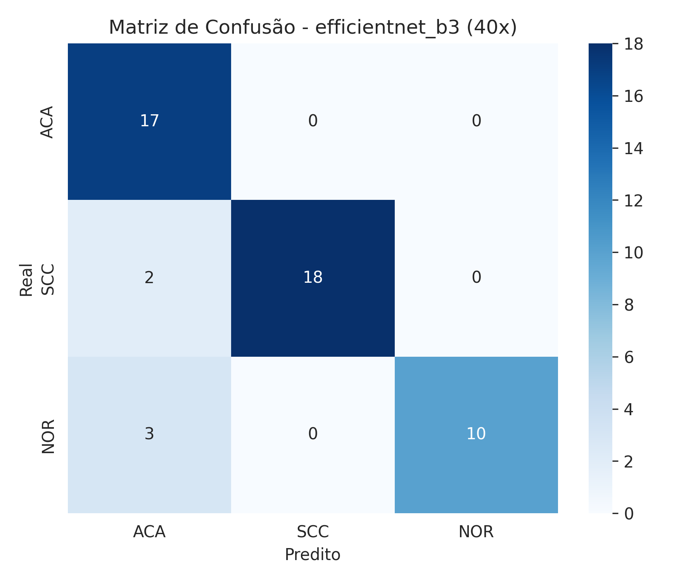
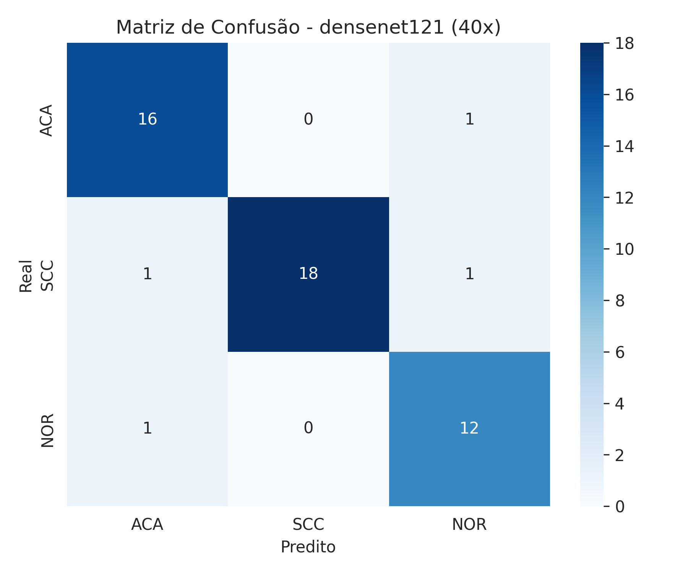
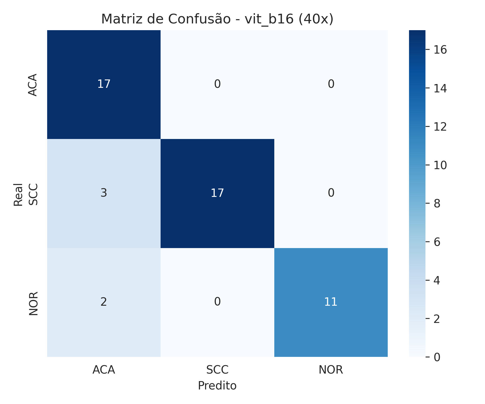
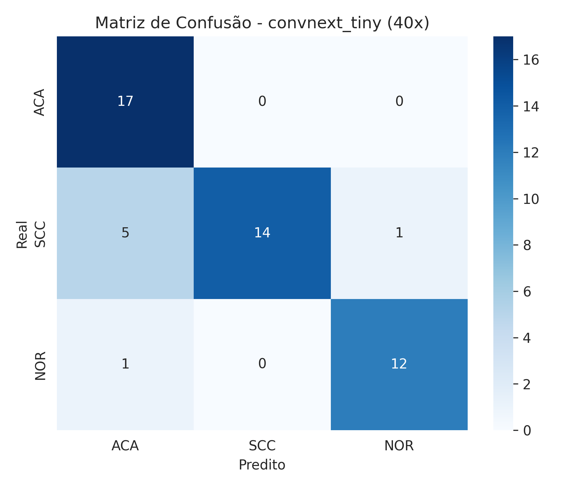

## IMPLEMENTAÇÕES

| Parâmetro              | Valor                |
|------------------------|----------------------|
| Tamanho da imagem      | 224 × 224            |
| Épocas                 | 100                  |
| Paciência              | 20                   |
| Batch size             | 32                   |
| Otimizador             | AdamW                |
| Scheduler              | Cosine Annealing     |
| T_max                  | 35                   |
| Learning rate mínima   | 1e-6                 |
| Weighted sampler       | Sim                  |
| Loss Function          | CrossEntropyLoss()   |
| Dropout                | 0.3                  |
---
## AUGMENTATION

| Técnica             | Valor                         |
|---------------------|-------------------------------|
| RandomResizedCrop   | 224                           |
| Rotação             | 15°                           |
| Flip Horizontal     | 0.5                           |
| Flip Vertical       | 0.5                           |
| RandAugment         | num_ops=2, magnitude=5        |

---
## Resultados Quantitativos

### Dataset 40x

| Modelo           | Accuracy | ROC-AUC | Kappa  | F1-score (macro) |
|------------------|----------|--------|--------|------------------|
| ResNet50         | 0.9200   | 0.9981 | 0.8786 | 0.9246           |
| EfficientNet-B3  | 0.9000   | 0.9966 | 0.8472 | 0.8962           |
| DenseNet121      | 0.9200   | 0.9974 | 0.8789 | 0.9168           |
| ViT-B16          | 0.9000   | 0.9939 | 0.8478 | 0.9025           |
| ConvNeXt-Tiny    | 0.8600   | 0.9952 | 0.7892 | 0.8655           |

---

### Dataset 20x

| Modelo           | Accuracy | ROC-AUC | Kappa  | F1-score (macro) |
|------------------|----------|--------|--------|------------------|
| ResNet50         | 0.8958   | 0.9572 | 0.8405 | 0.9028           |
| EfficientNet-B3  | 0.8125   | 0.9644 | 0.7195 | 0.8104           |
| DenseNet121      | 1.0000   | 1.0000 | 1.0000 | 1.0000           |
| ViT-B16          | 0.7500   | 0.9646 | 0.6252 | 0.7431           |
| ConvNeXt-Tiny    | 0.8958   | 0.9859 | 0.8410 | 0.9036           |
---
## Resultados

---

## Matrizes de Confusão

### Dataset 20x

---

### Dataset 40x

---
