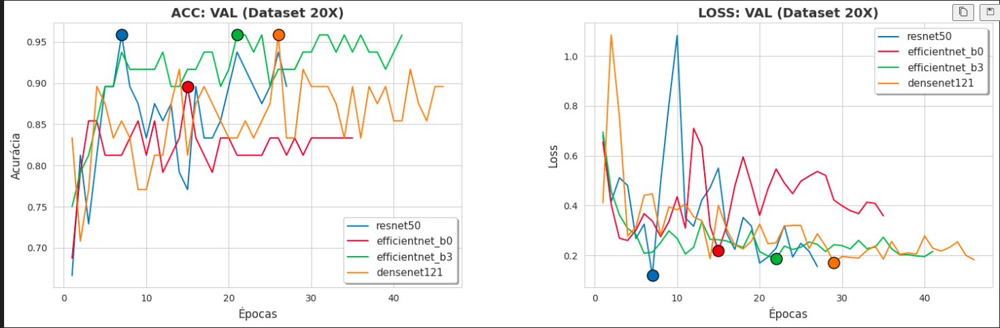
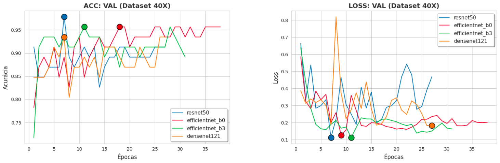

## IMPLEMENTAÇÕES

| Parâmetro              | Valor                |
|------------------------|----------------------|
| Tamanho da imagem      | 224 × 224            |
| Épocas                 | 100                  |
| Paciência              | 20                   |
| Batch size             | 32                   |
| Otimizador             | AdamW                |
| Scheduler              | Cosine Annealing     |
| T_max                  | 35                   |
| Learning rate mínima   | 1e-6                 |
| Weighted sampler       | Sim                  |
| Loss Function          | CrossEntropyLoss()   |

## AUGMENTATION

| Técnica             | Valor                         |
|---------------------|-------------------------------|
| RandomResizedCrop   | 224                           |
| Rotação             | 15°                           |
| Flip Horizontal     | 0.5                           |
| Flip Vertical       | 0.5                           |
| RandAugment         | num_ops=2, magnitude=7        |

## RESULTADOS — DATASET 40x

| Model             | Accuracy | ROC-AUC | Kappa | Precision (weighted) | Recall (weighted) | F1-score (weighted) |
|------------------|----------|----------|--------|----------------------|-------------------|---------------------|
| ResNet50         | 0.9800   | 1.0000   | 0.9695 | 0.9811               | 0.9800            | 0.9799              |
| EfficientNet-B0  | 0.9800   | 1.0000   | 0.9695 | 0.9811               | 0.9800            | 0.9799              |
| EfficientNet-B3  | 0.9800   | 0.9974   | 0.9695 | 0.9811               | 0.9800            | 0.9799              |
| DenseNet121      | 0.9400   | 0.9987   | 0.9080 | 0.9490               | 0.9400            | 0.9385              |

---

## RESULTADOS — DATASET 20x

| Model             | Accuracy | ROC-AUC | Kappa | Precision (weighted) | Recall (weighted) | F1-score (weighted) |
|------------------|----------|----------|--------|----------------------|-------------------|---------------------|
| ResNet50         | 0.9583   | 0.9902   | 0.9358 | 0.9623               | 0.9583            | 0.9581              |
| EfficientNet-B0  | 0.7917   | 0.9920   | 0.6817 | 0.8661               | 0.7917            | 0.7771              |
| EfficientNet-B3  | 0.8542   | 0.9792   | 0.7764 | 0.8739               | 0.8542            | 0.8520              |
| DenseNet121      | 0.9792   | 1.0000   | 0.9680 | 0.9803               | 0.9792            | 0.9792              |
---
## Resultados

---